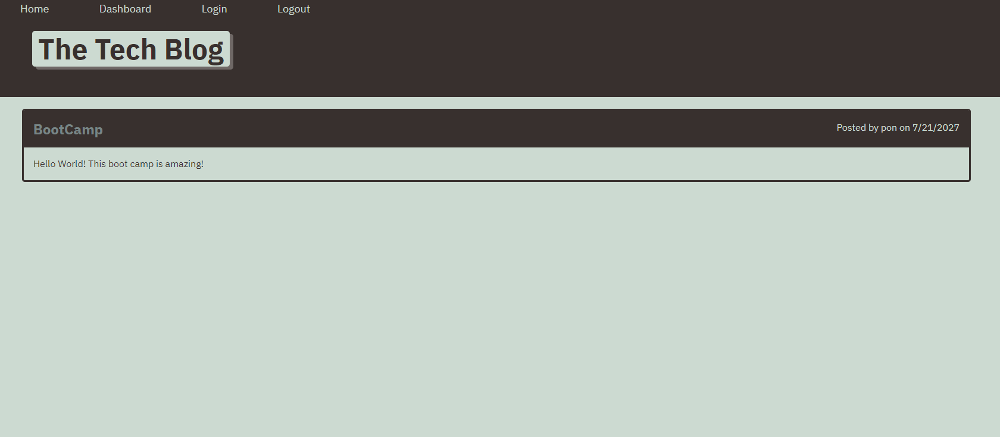
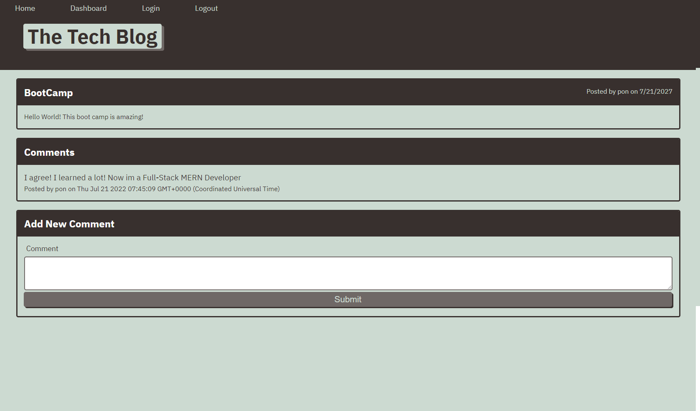
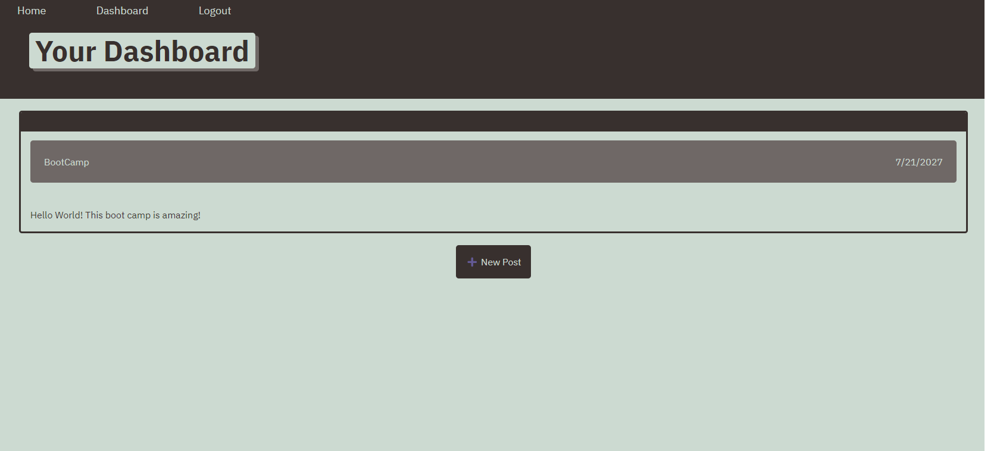

<h1 align="center">Tech Blog </h1>

---

# Description

# Description

This application is built following the MVC model. It uses express.js, sequelize mysql database in the back-end. 

It is a simple blog app that allow user to register to create a post, add comments, update, and delete their own post.

# Table of Contents

[Installation](#installation)

[Usage](#usage)

[Technologies](#technologies)

[Contribution](#contribution)

[Tests](#test)

[Questions](#questions)

[License](#license)

# Installation

1. First have Node.js installed
2. clone the repo and in your terminal type `git clone https://github.com/SophoanMeas/tech-blog.git`
3. type `npm i` to install all the node dependencies for this project
4. type `npm run start` to launch the application locally

# Usage
### Application

* <a href="https://tech-blog-pon.herokuapp.com/" target="_blank"><h4> *Tech Blog*</a>
# Technologies
Node Package Manager
* bcrypt - for hashing password
* dotenv
* express.js
* session - log user session
* sequelize - mysql database
* express - handlebars - for rendering the content 

Visual Appearance Package

* bootstrap
* css

# Contribution

N/A

# Test

N/A
# Questions

---

<h1 align="center">Contact Me</h1>

Check out my Github for more projects

Have a question? Feel free to drop me an email.

📧[sophoan.meas@hotmail.com](mailto:sophoan.meas@hotmail.com)

---
# License

#### Copyright© [sophoanMeas](https://github.com/sophoanMeas). All rights reserved.
#### Licensed under *GNU*

---
## Screenshot

